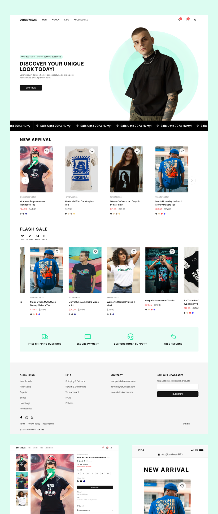

# Drukwear - Clothing E-commerce Website

Drukwear is a fully functional clothing e-commerce platform meticulously developed using React.js, Tailwind CSS, Shadcn UI, and React Query, with Supabase serving as the backend for seamless data management. The platform is designed to deliver a clean, modern, and intuitive shopping experience, ensuring user satisfaction and ease of navigation.

## 🌟 Features

- 🛒 **Product Listings**: Dynamic product cards with main and additional images.
- 💖 **Wishlist**: Add/remove items to/from wishlist, with a real-time counter update.
- 🔍 **Product Filtering**: Sort products by categories (Men, Women, Kids, Accessories).
- 📦 **Responsive Design**: Optimized for all screen sizes from mobile to desktop.
- 🎨 **Modern UI**: Built with Shadcn UI and Tailwind CSS for a clean, modern look.
- ⚡ **Fast & Performant**: Optimized with React Query for efficient data fetching.
- 🗄️ **Supabase Backend**: Secure and scalable backend with real-time updates.

  ## 🛠️ Built With

- **React.js** - JavaScript library for building user interfaces.
- **Tailwind CSS** - A utility-first CSS framework for rapid UI development.
- **Shadcn UI** - A modern and customizable component library.
- **Supabase** - Backend as a service providing real-time databases.
- **React Query** - Data fetching library for efficient client-side state management.

## 🎬 Screenshots

